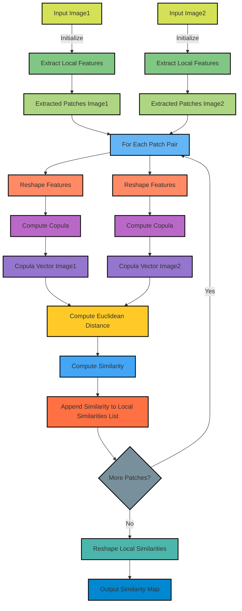

# Copula-based Similarity Metric (CSM)
A novel locally sensitive image similarity metric based on Gaussian Copula.

## Summary

- [📖 Overview](#-overview)
- [🌟 Features](#-features)
- [🚀 Getting Started](#-getting-started)
  - [Package Installation](#package-installation)
  - [Usage](#usage)
  - [Python library usage](#python-library-usage)
  - [Command-Line Usage](#command-line-usage)
- [Paper Results Reproducibility](#-paper-results-reproducibility)
- [📚 Example Use Case](#-example-use-case)
  - [MRI imagery: Human brain](#mri-imagery-human-brain)
  - [Astronomy: Andromeda Galaxy](#astronomy-andromeda-galaxy)
- [Licence](#licence)
- [Citation](#citation)

## 📖 Overview

Copula-based Similarity Metric (CSM) is a unique approach for measuring image similarity that leverages the properties of Gaussian copulas to provide a locally sensitive measure of similarity between images. Unlike traditional metrics, CSM is designed to capture both global and local image features, making it particularly effective for applications in medical imaging, remote sensing, and any domain requiring fine-grained image comparison.

A visual graph of the CSM implementation is given in the following diagram:



## 🌟 Features

- **Locally Sensitive**: Captures detailed differences at a granular level.
- **Gaussian Copula-Based**: Utilizes statistical properties for robust similarity measurement.
- **Versatile Usage**: Suitable for various image types and applications.
- **Extensible**: Easily installation package and fast use.


## 🚀 Getting Started

### Package Installation

To install the CopulaSimilarity package, you can use pip:

```bash
pip install CopulaSimilarity
```

or

```bash
git clone https://github.com/safouaneelg/copulasimilarity.git

pip install -r requirements.txt
pip install -e .

```
### Python library usage

you can import the package and estimate the similarity map as follow:

```py
from CopulaSimilarity.CSM import CopulaBasedSimilarity as CSMSimilarity
import matplotlib.pyplot as plt
import numpy as np

# Default patch_size set to 8 but can be changed depending on the aimed balance between accuracy and realtime
copula_similarity = CSMSimilarity(patch_size=8) 

#load your images
image1 = cv2.imread('path_to_image1')
image2 = cv2.imread('path_to_image2')

#calculate the similarity map
csm_map = copula_similarity.compute_local_similarity(image, blurred_image)

# Optionally: you can show the similarity map using cv2 or matplotlib
#cv2.imshow('Similarity Map', csm_map)
# or
plt.imshow(csm_map, cmap='virdis')

#if you need a single value you can calculate the mean of the copula similarity map
csm_mean = np.mean(csm_map)
```

Other metrics can also be used, the implementation is based on (image-similarity-measures)[https://github.com/nekhtiari/image-similarity-measures/tree/master] package. you can either install it using `pip install image-similarity-measures` command, or you can also use our implementation.
To use other metrics such as SSIM FSIM and ISSM, it's very similar however they only return a value. Tutorial:

```py
from similarity_metrics.fsim_quality import FSIMsimilarity
from similarity_metrics.issm_quality import ISSMsimilarity

fsim_similarity = FSIMsimilarity()
issm_similarity = ISSMsimilarity()

#load your images
image1 = cv2.imread('path_to_image1')
image2 = cv2.imread('path_to_image2')

ssim_value = fsim_similarity.fsim(image1, image2)
issm_value = issm_similarity.issm(image1, image2)
```
### Command-Line Usage

Two codes are provided within this repository, one for static comparison and the other for dynamic analysis.

To run those, the github repository should be clones and requirements installed. Follow [Installation](#installation).

Afterward, below command line can be executed.

**Static Comparison**

You can use the provided command-line tool `compare_images.py` to compute image similarity metrics directly from the terminal between two images as following.

```python compare_images.py --path1 PATH_TO_IMAGE1 --path2 PATH_TO_IMAGE2 [--issm] [--fsim] [--ssim] [--rmse] [--psnr] [--save_csm_map]```

Arguments
- `--path1`: (REQUIRED) Path to the first image
- `--path2`: (REQUIRED) Path to the second image
- `--issm`: (OPTIONAL) Compute ISSM similarity
- `--fsim`: (OPTIONAL) Compute FSIM similarity
- `--ssim`: (OPTIONAL) Compute SSIM similarity
- `--rmse`: (OPTIONAL) Compute RMSE
- `--psnr`: (OPTIONAL) Compute PSNR
- `--save_csm_map`: (OPTIONAL) Save the Copula-Based Similarity Map as an image file
- `--patch_size` (OPTIONAL, DEFAULT=8): Specifies the size of the patches used in the Copula-Based Similarity (CSM) computation. This parameter determines the dimensions of the image patches extracted for similarity analysis. A smaller patch size can lead to higher accuracy in capturing fine-grained details but may increase processing time due to the larger number of patches (default set to 8)

**Dynamic Comparison**

We also provide a code `video_analysis.py` for frame-by-frame analysis, where the similarity is computed between the first frame considered as reference and subsequent ones as mentionned in the paper. To run the code, you can execute the following command line.

```python video_analysis.py --path_to_video PATH_TO_VIDEO --output_video_path OUTPUT_VIDEO_PATH.mp4 [--issm] [--fsim] [--ssim] [--save_final_frame] [--show_live_window] [--resolution_factor=RESOLUTION ]FACTOR]```

Arguments
- `--path_to_video`: (REQUIRED) Path to the video
- `--output_video_path`: (REQUIRED) Output path to save the resulting video analysis
- `--issm`: (OPTIONAL) Compute ISSM similarity
- `--fsim`: (OPTIONAL) Compute FSIM similarity
- `--ssim`: (OPTIONAL) Compute SSIM similarity
- `--save_final_frame`: (OPTIONAL) Save the final result figure
- `--show_live_window`: (OPTIONAL) Show live processing (might be slow due to video resolution or texture and due to FSIM slow computation)
- `--resolution_factor`: (OPTIONAL, DEFAULT=8) Resolution factor te reduce video size for fast processing
- `--patch_size` (OPTIONAL, DEFAULT=8): Specifies the size of the patches used in the Copula-Based Similarity (CSM) computation. This parameter determines the dimensions of the image patches extracted for similarity analysis. A smaller patch size can lead to higher accuracy in capturing fine-grained details but may increase processing time due to the larger number of patches

## 📰 Paper Results Reproducibility

The results provided in our paper can be reproduced following the notebooks [Comparative_study_eval.ipynb](/Comparative_study_eval.ipynb) and [CSIQ_eval.ipynb](/CSIQ_eval.ipynb). You can also plot the figure from save *pickle* files in [pkldata](/pkldata/).

## 📚 Example Use Case

Two use cases have been studied in the paper: Healthcare and astronomy. In both, we have recovered part of Youtube videos (link below), to which we have applied the CSM and compared it to other metrics SSIM ISSM and FSIM. The first frame is fixed and taken as reference, and the four similarity metrics are calculated between reference frame and subsequent ones.

### MRI imagery: Human brain 

[MRI captures movement of the brain - 0:10 to 0:16](https://www.youtube.com/watch?v=Po-1tm8wS6c)
The example below shows a comparative study on an MRI video with a moving Gland. Curves plot highlights the differences captured by each metric, demonstrating the high sensitivity and accuracy of CSM in returning low value but also locating the changes in the Copula Similarity Map.


### Astronomy: Andromeda Galaxy 

[Andromeda Galaxy - 2:16 to 2:26](https://www.youtube.com/watch?v=f4UbhX2lF4Y)
The example below shows a comparative study on an Andromeda Galaxy video with a moving circle by the center of the video. The intensity is very slightly changing between the frames as it is barely visible even in raw difference between current frame and reference frame (Video - b). However, the CSM still captures the differences precisely as show in Copula Similarity Map.


## Licence

This code is made available for research purposes only and is not licensed for commercial use.

## Citation
<!--Please cite use if you use our implementation as following:-->