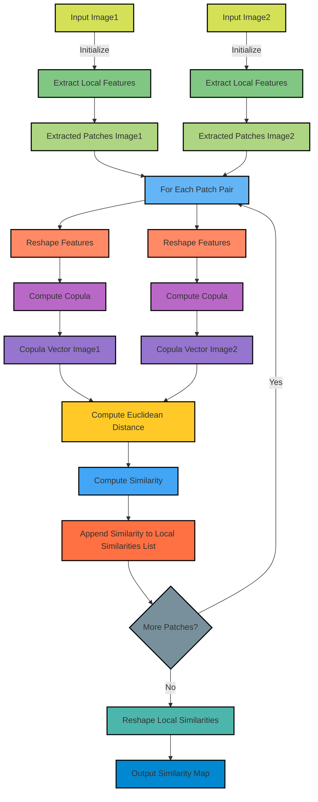

# Copula-based Similarity Metric (CSM)
A novel locally sensitive image similarity metric based on Gaussian Copula.


## 📖 Overview

Copula-based Similarity Metric (CSM) is a unique approach for measuring image similarity that leverages the properties of Gaussian copulas to provide a locally sensitive measure of similarity between images. Unlike traditional metrics, CSM is designed to capture both global and local image features, making it particularly effective for applications in medical imaging, remote sensing, and any domain requiring fine-grained image comparison.

A visual graph of the CSM implementation is given in the following diagram:



## 🌟 Features

- **Locally Sensitive**: Captures detailed differences at a granular level.
- **Gaussian Copula-Based**: Utilizes statistical properties for robust similarity measurement.
- **Versatile Usage**: Suitable for various image types and applications.
- **Extensible**: Easily integrates with other image quality metrics like SSIM, FSIM, and ISSM.


## 🚀 Getting Started

### Installation

To install the CopulaSimilarity package, you can use pip:

```bash
pip install CopulaSimilarity
```

### Usage

you can import the package and estimate the similarity map as follow:

```py
from CopulaSimilarity.CSM import CopulaBasedSimilarity as CSMSimilarity

copula_similarity = CSMSimilarity()

#load your images
image1 = cv2.imread('path_to_image1')
image2 = cv2.imread('path_to_image2')

#calculate the similarity map
csm_map = copula_similarity.compute_local_similarity(image, blurred_image)

# Optionally: you can show the similarity map using cv2 or matplotlib
#cv2.imshow('Similarity Map', csm_map)
# or
#plt.imshow(csm_map, cmap='virdis')

#if you need a single value you can calculate the mean of the copula similarity map
csm_mean = np.mean(csm_map)
```

Other metrics can also be used, the implementation is based on (image-similarity-measures)[https://github.com/nekhtiari/image-similarity-measures/tree/master] package. you can either install it using `pip install image-similarity-measures` command, or you can also use our implementation.
To use other metrics such as SSIM FSIM and ISSM, it's very similar however they only return a value. Tutorial:

```py
from similarity_metrics.fsim_quality import FSIMsimilarity
from similarity_metrics.issm_quality import ISSMsimilarity

fsim_similarity = FSIMsimilarity()
issm_similarity = ISSMsimilarity()

#load your images
image1 = cv2.imread('path_to_image1')
image2 = cv2.imread('path_to_image2')

ssim_value = fsim_similarity.fsim(image1, image2)
issm_value = issm_similarity.issm(image1, image2)
```
### Command-Line Usage

**Static Comparison**

You can use the provided command-line tool `compare_images.py` to compute image similarity metrics directly from the terminal between two images as following.

```python compare_images.py --path1 PATH_TO_IMAGE1 --path2 PATH_TO_IMAGE2 [--issm] [--fsim] [--ssim] [--rmse] [--psnr] [--save_csm_map]```

Arguments
- --path1: (REQUIRED) Path to the first image
- --path2: (REQUIRED) Path to the second image
- --issm: (OPTIONAL) Compute ISSM similarity
- --fsim: (OPTIONAL) Compute FSIM similarity
- --ssim: (OPTIONAL) Compute SSIM similarity
- --rmse: (OPTIONAL) Compute RMSE
- --psnr: (OPTIONAL) Compute PSNR
- --save_csm_map: (OPTIONAL) Save the Copula-Based Similarity Map as an image file

**Dynamic Comparison**

We also provide a code `video_analysis.py` for frame-by-frame analysis, where the similarity is computed between the first frame considered as reference and subsequent ones as mentionned in the paper. To run the code, you can execute the following command line.

```python video_analysis.py --path_to_video PATH_TO_VIDEO --output_video_path OUTPUT_VIDEO_PATH.mp4 [--issm] [--fsim] [--ssim] [--save_final_frame] [--show_live_window] [--resolution_factor=RESOLUTION ]FACTOR]```

Arguments
- --path_to_video:     (REQUIRED) Path to the video
- --output_video_path: (REQUIRED) Output path to save the resulting video analysis
- --issm: (OPTIONAL) Compute ISSM similarity
- --fsim: (OPTIONAL) Compute FSIM similarity
- --ssim: (OPTIONAL) Compute SSIM similarity
- --save_final_frame: (OPTIONAL) Save the final result figure
- --show_live_window: (OPTIONAL) Show live processing (might be slow due to video resolution or texture and due to FSIM slow computation)
- --resolution_factor: (OPTIONAL) Resolution factor te reduce video size for fast processing (default is 8)


## 📚 Example Use Case

The example below shows a comparative study on MRI imagery, where the first frame is fixed, and similarity metrics (SSIM, FSIM, ISSM, and CSM) are calculated between that frame and subsequent ones. This highlights the differences captured by each metric, demonstrating the unique sensitivity and accuracy of CSM in various scenarios.


## Licence

The work can be used for research purposes.

<!--Please cite use if you use our implementation as following:-->